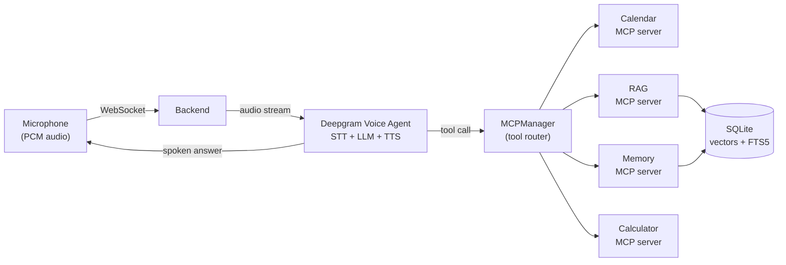

# Fraise 🍓

**A voice-first AI assistant you talk to out loud, and it actually does things.** Ask it a question, tell it to add a calendar event, or drop in a PDF and ask about it. Fraise routes every request through the Model Context Protocol (MCP), so its skills are pluggable servers, not hard-coded features. Everything document-related runs on-device.

**Live :** [fraise.vercel.app](https://fraise.vercel.app)

---

## What it is

Fraise is a full-stack voice agent. You speak, it listens in real time, decides whether it can answer directly or needs a tool, calls the right tool, and speaks the answer back. The interesting part is the architecture:

- **Voice runs over a single WebSocket** to Deepgram's Voice Agent, so speech-to-text, the language model, and text-to-speech share one low-latency stream instead of three round-trips.
- **Skills are MCP servers.** A router discovers every tool at startup from one JSON config. Adding a new capability is one config entry, no changes to the agent.
- **Document Q&A is fully on-device.** No PyTorch, no embedding API, nothing about your files leaves the machine.

---

## Architecture



**Request lifecycle:** microphone PCM streams over the WebSocket to the FastAPI backend, which relays it to the Deepgram Voice Agent. When the model decides it needs a tool, the call goes to the `MCPManager` router, which dispatches to the correct MCP server (calendar, memory, RAG, or calculator). The result flows back into the live conversation and Fraise speaks the answer, all in one continuous stream.

---

## How document search works (the on-device RAG pipeline)

When you upload a `.txt`, `.md`, or `.pdf`, questions about it are answered by a four-stage retrieval pipeline that runs entirely on your machine:

| Stage | What happens | Why it matters |
| --- | --- | --- |
| **1. Late chunking** | The whole document is embedded first, then split into chunks. | Each chunk keeps the context of the text around it instead of being embedded in isolation. |
| **2. Local embeddings** | `jina-embeddings-v2-small-en` runs through ONNX Runtime. | No PyTorch and no external API. Fast, private, and dependency-light. |
| **3. Hybrid search** | Semantic vector search (`sqlite-vec`) and keyword search (SQLite FTS5 / BM25) run together and are fused. | Passages that both meaning *and* exact terms agree on rank highest, catching what either method alone would miss. |
| **4. Reranking** | A cross-encoder scores the question against each top candidate and keeps only the best few. | The model only ever sees the most relevant passages, which improves answer quality and keeps the prompt small. |

The winning passages are handed to the voice model already mid-conversation, so it speaks the answer directly.

---

## Features

- **Real-time voice** over a single WebSocket (low-latency STT to LLM to TTS).
- **Pluggable skills via MCP** — capabilities are servers discovered from config, not baked-in code.
- **On-device document Q&A** — upload a PDF/txt/md and ask about it; nothing leaves your machine.
- **Calendar actions** with Google OAuth (create and read events by voice).
- **Persistent memory** so the assistant remembers things across a session.
- **Reactive 3D orb** (React Three Fiber) that responds to the conversation.
- **Spoken confirmation for destructive actions** so the agent can't do something irreversible on a mishearing.

---

## Tech stack

**Frontend:** React 19, TypeScript, Vite, React Three Fiber (Three.js), an AudioWorklet (`pcm-worklet.js`) for raw microphone PCM.

**Backend:** Python, FastAPI, WebSockets, the MCP Python SDK.

**Voice:** Deepgram Voice Agent (STT + LLM + TTS over one connection).

**Retrieval:** ONNX Runtime, `jina-embeddings-v2-small-en`, `sqlite-vec`, SQLite FTS5, a cross-encoder reranker.

**Storage:** SQLite (documents, vectors, and memory).

---

## Project layout

```
backend/
  app/
    main.py                 # FastAPI app, WebSocket + upload routes
    host/
      voice_agent.py        # Deepgram Voice Agent session
      mcp_manager.py        # discovers + routes MCP tools
    servers/
      calculator.py         # MCP server: arithmetic
      calendar.py           # MCP server: Google Calendar
      memory/               # MCP server: persistent memory
      rag/                  # MCP server: chunk, embeddings, rerank, store
    storage/db.py           # SQLite access
  mcp_servers.json          # one entry per skill; edit this to add tools
frontend/
  src/
    useVoiceAgent.ts        # WebSocket + audio streaming hook
    Orb.tsx                 # reactive 3D orb
    App.tsx
    public/pcm-worklet.js   # microphone PCM capture
```

---

## API

The backend is a single FastAPI process. Base URL in development is `http://localhost:8000`.

| Method | Path | Description |
| --- | --- | --- |
| `GET` | `/health` | Liveness check. Returns `{"ok": true}`. |
| `WS` | `/ws?sid=<id>` | Voice session. Microphone PCM in; audio and JSON events out. |
| `POST` | `/upload?sid=<id>` | Add a document (`.txt`, `.md`, `.pdf`). Returns `400` if no readable text. |
| `GET` | `/auth/calendar` | Begins the Google Calendar OAuth flow. |

---

## Getting started

### Prerequisites

- Python 3.11+
- Node 18+
- A Deepgram API key
- (Optional) Google OAuth credentials for the calendar server

### Backend

```bash
cd backend
python -m venv .venv && source .venv/bin/activate
pip install -r requirements.txt
cp .env.example .env        # add DEEPGRAM_API_KEY (and Google creds if using calendar)
python -m app.main          # serves on http://localhost:8000
```

### Frontend

```bash
cd frontend
npm install
npm run dev                 # serves on http://localhost:5173
```

Open the frontend, allow microphone access, and start talking.

---

## Adding a new skill

Every skill is an MCP server. To add one:

1. Write a small MCP server (see `backend/app/servers/calculator.py` for the minimal shape).
2. Add one entry to `backend/mcp_servers.json` pointing at it.
3. Restart. The `MCPManager` discovers the new tools at startup and the voice agent can use them immediately, with no changes to the agent code.

Name collisions across servers are resolved automatically with server-name prefixes.

---

## Roadmap

See [ROADMAP.md](ROADMAP.md).

---

## Why I built it

I wanted a voice assistant where adding a skill didn't mean rewriting the assistant, and where asking questions about my own documents didn't mean shipping them to someone else's server. MCP solved the first problem; an on-device retrieval pipeline solved the second. Fraise is the result.
